# 🌍 Climatopia - Project Architecture

## 🏗️ Complete System Architecture

## 🔄 Data Flow Architecture

## 📱 Feature Flow Diagram

```mermaid
graph LR
    subgraph "🌦️ Weather Features"
        A[Real-time Weather] --> A1[City Search]
        A1 --> A2[Weather Display]
        A2 --> A3[Weather Charts]
    end

    subgraph "🤖 AI Predictions"
        B[What If Questions] --> B1[Natural Language Processing]
        B1 --> B2[ML Model Selection]
        B2 --> B3[Prediction Generation]
        B3 --> B4[Result Visualization]
    end

    subgraph "👥 Social Features"
        C[Community Feed] --> C1[Post Questions]
        C1 --> C2[Like & Comment]
        C2 --> C3[Achievement Badges]
        C3 --> C4[NFT Conversion]
    end

    subgraph "💳 Credit System"
        D[Credit Management] --> D1[Free Credits]
        D1 --> D2[Subscription Plans]
        D2 --> D3[Payment Processing]
        D3 --> D4[Credit Top-up]
    end

    %% Connections between features
    A --> B
    B --> C
    C --> D
```

## 🏗️ Technical Stack Overview

## 📊 Credit System Flow

## 🌍 Project Statistics

| Component | Technology | Purpose |
|-----------|------------|---------|
| **Frontend** | Next.js 14 + React | User interface and experience |
| **Backend** | Next.js API Routes | REST API and business logic |
| **Authentication** | Clerk | User management and security |
| **Database** | MongoDB Atlas | Data persistence |
| **ML Engine** | Python + FastAPI | AI predictions and analysis |
| **Payments** | Stripe | Subscription and credit management |
| **Deployment** | Vercel + Railway | Cloud hosting |
| **Storage** | Cloudinary | Media and file storage |
| **Web3** | Solidity + IPFS | NFT badges (optional) |

## 🔗 API Endpoints Overview

### Frontend APIs (Next.js)
- `/api/user/*` - User management
- `/api/posts/*` - Social features
- `/api/credits/*` - Credit system
- `/api/payments/*` - Subscription handling

### ML APIs (Python FastAPI)
- `/predict_economic_impact` - Economic predictions
- `/predict_croprate` - Agricultural forecasting
- `/predict_electricity` - Energy demand
- `/predict_adaptation` - Climate adaptation
- `/temperature_prediction` - Weather forecasting
- `/humidity_prediction` - Humidity analysis

---

**Built with ❤️ by Team T3Coders**  
*Climatopia - Simulating Earth's Future with AI*
